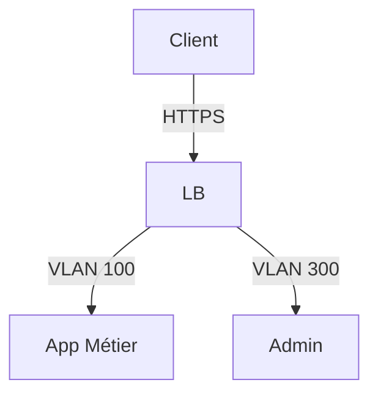

# Contributing Guide - MEDISOL Project

Merci de contribuer au projet de modernisation infrastructure MEDISOL ! 🎯

## 📋 Avant de Commencer

- Consultez [README.md](README.md) pour comprendre le contexte
- Vérifiez les **Issues ouvertes** pour ne pas dupliquer le travail

---

## 🤝 Processus de Contribution

### 1. **Créer une Branch**

```bash
git checkout -b feature/ma-feature
# ou
git checkout -b bugfix/mon-bug
# ou
git checkout -b docs/ma-documentation
```

**Convention de nommage :**

- `feature/xxx` - Nouvelle fonctionnalité
- `bugfix/xxx` - Correction de bug
- `docs/xxx` - Documentation
- `chore/xxx` - Maintenance/configuration
- `test/xxx` - Tests, validation PRA

### 2. **Faire vos Modifications**

⚠️ **RÈGLES CRITIQUES** :

1. **❌ JAMAIS de données sensibles** :
   - Pas de mots de passe, tokens, API keys
   - Pas d'IP réelles, domaines internes
   - Pas de données patients
   - Utiliser `.env.template` pour configs

2. **✅ Documentation toujours à jour** :
   - Mettre à jour README si changement architecture
   - Ajouter commentaires pour logique complexe
   - Documenter toute décision dans `/docs`

3. **✅ Suivre les conventions du projet** :
   - Indentation : 2 espaces (yaml) ou 4 espaces (code)
   - Noms fichiers : `kebab-case` (my-file.md)
   - Commit messages : clair et détaillé

### 3. **Tester Localement**

```bash
# Valider syntaxe YAML/JSON
cd infrastructure/
yamllint *.yaml
jq . < config.json

# Valider links Markdown
markdownlint docs/*.md

# Si scripts : tester
./scripts/backup/backup.sh --dry-run
```

### 4. **Commit & Push**

```bash
# Commits atomiques, clairs
git add <fichiers-modifiés>
git commit -m "feat: add network segmentation VLAN config

- Ajouter VLAN métier (100), invités (200), admin (300)
- Configurer ACL inter-VLAN
- Documenter en docs/ARCHITECTURE.md
- Refs #123"

git push origin feature/ma-feature
```

### 5. **Créer une Pull Request**

Template de PR :

```markdown
## Description

### Changements

- Item 1
- Item 2

### Checklist

- [ ] Pas de données sensibles
- [ ] Tests passent
- [ ] Docs à jour
- [ ] Pas de breaking changes

### Lien à des Issues

Closes #123
Related to #456
```

### 6. **Code Review & Merge**

- **Minimum 1 approbation** pour merger
- Address les commentaires reviewers
- Une fois approuvé : **merge et delete branch**

---

## 📝 Guidelines Documentation

### Structure

- **README** = contexte global + quick start
- **ARCHITECTURE.md** = design cible, diagrams
- **REQUIREMENTS.md** = exigences métier/techniques
- **AUDIT_FINDINGS.md** = état actuel
- **PRA_PCA_PLAN.md** = stratégie reprise
- **CONFORMITE_HDS.md** = checklist compliance

### Format

```markdown
# Titre (h1)

## Sous-titre (h2)

- Point 1
- Point 2

| Col1 | Col2 |
| ---- | ---- |
| A    | B    |

> Citation/Note important
```

### Diagrams

Utiliser **Mermaid** pour architecture :



---

## 🐛 Reporting Bugs

1. Vérifier si bug **déjà reporté** (Issues)
2. Créer Issue avec :
   - **Titre clair** : "Wi-Fi atelier déconnexions aléatoires"
   - **Description détaillée** : contexte, étapes reproduction
   - **Logs/Evidences** : captures, metrics
   - **Impact** : production ? test ? non-bloquant ?
   - **Environment** : version SW, hardware, config

Template :

```markdown
## Description Bug

[Décrire le problème]

## Reproduction

1. Faire X
2. Ensuite Y
3. Observer Z

## Comportement Attendu

[Décrire ce qui devrait se passer]

## Comportement Actuel

[Décrire ce qui se passe]

## Environnement

- OS: [e.g. Windows 10]
- Hardware: [e.g. AP Aruba 1000]
- Version: [e.g. v1.2.3]

## Logs/Evidence

[Attacher logs, captures d'écran]
```

---

## 💡 Proposer des Améliorations

1. Créer une **Discussion** (pas une Issue)
2. Décrire :
   - **Problème actuel**
   - **Solution proposée**
   - **Bénéfices**
   - **Effort/Coûts**
3. Recueillir feedback avant Issue officielle

---

## 🔒 Sécurité & Conformité

### Avant chaque Commit

```bash
# Vérifier aucun secret
git diff --cached | grep -E "(password|secret|key|token)" && echo "⚠️ Secrets detected!"

# Vérifier fichiers binaires/passwords
git ls-files -o --exclude-standard | grep -E "(\.pem|\.key|\.env)" && echo "⚠️ Config files!"
```

### Secrets Accidentels ?

1. **IMMÉDIATEMENT** : déplacer le secret dans `.env.template` (sans valeur)
2. Notifier RSSI
3. Rotate tous les tokens/passwords
4. Utiliser `git filter-branch` pour nettoyer historique

---

## 📚 Ressources Utiles

- [Docs HDS](https://esante.gouv.fr/)
- [RGPD Santé](https://www.cnil.fr/rgpd-sante)
- [Markdown Syntax](https://www.markdownguide.org/)
- [Mermaid Diagrams](https://mermaid.live/)
- [Git Workflow](https://www.atlassian.com/git/tutorials/comparing-workflows)

---

## 🆘 Besoin d'Aide ?

- **Questions projet ?** → Issues + Discussions
- **Technique ?** → Slack/Teams du projet
- **Sécurité ?** → Contactez RSSI directement

---

## ✅ Checklist Avant Merge

- [ ] Pas de données sensibles dans les fichiers
- [ ] Tous les tests passent
- [ ] Documentation à jour (README, docs/, commentaires)
- [ ] Commit messages clairs et détaillés
- [ ] Branche à jour avec `main`
- [ ] Minimum 1 approbation code review
- [ ] Pas de conflits

---

**Merci pour votre contribution !** 🚀
